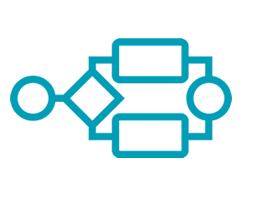

<h1 align="center">
    SeenTa Bpmn Process Editor
</h1>

[//]: # (<h3>Learn More & Request In My Site:</h3>)

[//]: # (<a href="https://asktocode.com">)

[//]: # (![WebSite]&#40;https://img.shields.io/badge/Ask_to_code-a12?style=for-the-badge&logo=firefox&logoColor=white&#41;)
[//]: # (</a>)
  ## 📫 How to reach me: 

[//]: # (  - **info@asktocode.com**)
  - **taherisohrab4@gmail.com**
     

## 📠 Connect with me

  

  

</a></a>

   

### Beginning
   > This Project Inherited From [Diagram Js](https://github.com/bpmn-io/diagram-js) & [BPMN JS](https://github.com/bpmn-io/bpmn-js)

### Phrases I Use In Guidelines
  > Sidebar : **The Left Sector**
    Panel : **The Right Sector**
    Screen : **The Sector Between Sidebar & Panel**
    Toolbar : **The Top Sector**
    Context Pad : **The Sector Which Is Shown After Clicking On An Element Placed On The Screen**
    Props : **Different Elements Properties**
    Element : **Any Shape You See On The Screen**
    Module : **Any Shape You See On The Sidebar**
    Connector : **Any Arrow Which Connects Two Elements Together**
### My Steps
> **The Steps I Have Done:**
   1) Add Custom Element To The Sidebar
   2) Draw & Show Custom Element By Dragging To The screen
   3) Save Diagram As BPMN & XML With New Custom Elements  4) Load Saved Diagram With New Custom Elements
   5) Add Color Palette Which I Call It "Set Color" In The Context Pad & Apply Changes On Selected Element 
   6) Customize The Panel Base On Which Element Is Selected(Props)
   7) Save Diagram With Different Props On Panel
   8) Load Diagram With Different Props On Panel (Preview)
   9) Add Name For Any Connector Using An Input Value Which Is Shown On Top Of The Named Connector After Loading Diagram
  
It's Possible To Draw An Object That Would Be Different From What You Added On Sidebar If You Wished
#Let's Go Further
  > ##Steps
  > ### 1) How To Add New Module
  > ###### 1.1 Add Your Icon/Image To Your Project
  > ###### 1.2 Define Your Custom Icon In "Palette.scss" Like Below:
  >> .YouIconName-module{ 
  background-image: url("The Path Of Your Icon"); 
  background-size: The Icon Size You Want To Show On Sidebar; 
  background-position: center center; 
  background-repeat: no-repeat; 
  }
  > ###### 1.3 Now You Have To Call & Fire .YourIconName-Module In Different Parts Of The App To Enable It And Shown  

    
